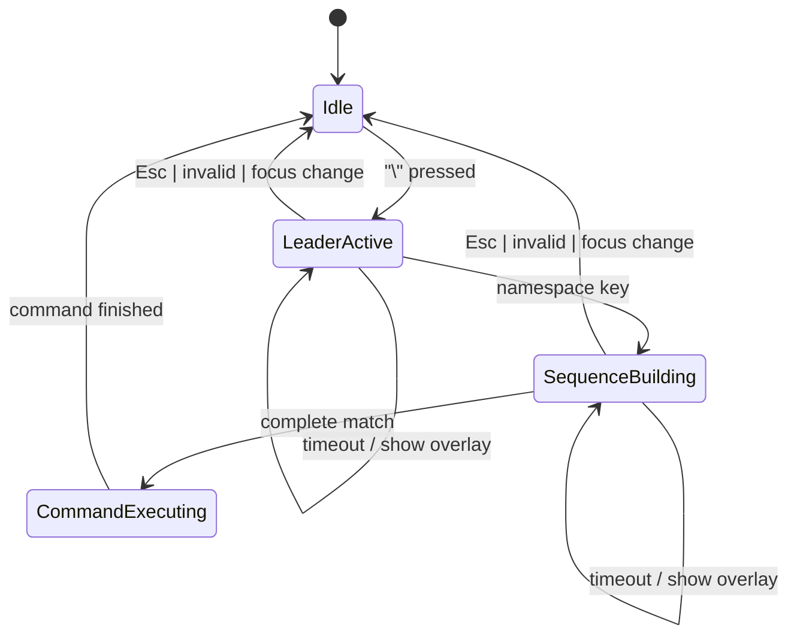

# ADR 001: Leader State Machine

## Status

Proposed

## Context

Lazysql currently routes keyboard input through `tview.SetInputCapture` on
focused primitives (tree, tables, modals, editor) and resolves key events with
`app.Keymaps.Group(...).Resolve(event)` before switching on `commands.Command`.
The application-level input capture is reserved for Ctrl+C shutdown handling.

To make lazysql feel Vim-native, the leader key (`\`) must behave as a prefix
that arms a multi-key sequence, supports timeouts, shows a which-key overlay,
and cancels cleanly on invalid keys or Escape. The leader system must integrate
without breaking existing keymaps or tview input capture flow.

## Decision Drivers

- Preserve existing component-level input handling.
- Keep the leader logic testable and independent of tview.
- Support multi-key sequences with discoverability (which-key).
- Ensure timeouts do not block the UI or leak goroutines.
- Provide a clear integration contract for future leader namespaces.

## Decision

Implement a small, pure leader state machine that consumes key events and
emits actions for the UI/router. The state machine is driven by a sequence
resolver (prefix tree) and a timeout manager. It does not execute commands
directly; it returns the resolved `commands.Command` to the caller so the
existing dispatch pipeline can run it in the right context.

### States

- **Idle**: Waiting for the leader key.
- **LeaderActive**: Leader pressed; waiting for first key in the sequence.
- **SequenceBuilding**: A valid prefix exists; waiting for more keys.
- **CommandExecuting**: A full sequence matched and is being executed.

### Events and Transitions

- **Idle → LeaderActive**: Leader key pressed (`\`). Start timer.
- **LeaderActive → SequenceBuilding**: Valid namespace key (f, d, r, s, t, b,
  w, x, c). Reset timer; update prefix.
- **LeaderActive → Idle**: Escape, invalid key, focus loss, or explicit cancel.
- **SequenceBuilding → CommandExecuting**: Sequence matches a command.
- **SequenceBuilding → SequenceBuilding**: Partial match; reset timer; update
  prefix.
- **SequenceBuilding → Idle**: Escape, invalid key, focus loss, or explicit
  cancel.
- **CommandExecuting → Idle**: Command completion callback.

### Timeout and Which-key Behavior

- **Timeout delay**: configurable, default 500ms.
- When the timeout fires, the which-key overlay is shown for the current prefix
  (`\`, `\f`, `\ft`). The sequence remains armed (no cancellation on this
  timeout).
- If no input follows, an optional idle-cancel timeout can reset the leader
  state. Default: disabled (`0`). When enabled, it can be configured as a
  second window of inactivity after the overlay appears.
- Any valid key press resets the timeout and updates the overlay content.
- Explicit help sequences (e.g., `\?`) can force overlay display without
  changing the state machine.

### Cancellation

- `Esc` cancels the sequence and hides the overlay.
- Invalid keys cancel by default and are consumed (optional beep/flash).
- Focus change can cancel if the router decides the leader should not remain
  armed.

### State Diagram



### Interfaces (Go)

```go
package leader

import (
	"context"
	"time"

	"github.com/jorgerojas26/lazysql/commands"
)

type State uint8

const (
	StateIdle State = iota
	StateLeaderActive
	StateSequenceBuilding
	StateCommandExecuting
)

// KeyEvent is a tview-agnostic key description used by the state machine.
type KeyEvent struct {
	Rune rune
	Key  KeyCode
}

type KeyCode uint8

const (
	KeyNone KeyCode = iota
	KeyEscape
	KeyLeader
)

type Action uint8

const (
	ActionNone Action = iota
	ActionConsume
	ActionShowWhichKey
	ActionHideWhichKey
	ActionExecute
	ActionCancel
)

type Result struct {
	Action   Action
	State   State
	Command commands.Command
	Prefix  []rune
	Invalid rune
}

// Resolver maps sequences to commands and indicates partial matches.
type Resolver interface {
	Resolve(sequence []rune) (commands.Command, bool)
	HasPrefix(sequence []rune) bool
	NextKeys(prefix []rune) []rune
}

// Timer abstracts timeout behavior for deterministic tests.
type Timer interface {
	Reset(time.Duration)
	Stop() bool
	C() <-chan time.Time
}

type TimerFactory interface {
	NewTimer(time.Duration) Timer
}

// StateMachine consumes key events and emits actions for the router/UI.
type StateMachine interface {
	HandleKey(ctx context.Context, key KeyEvent) Result
	OnTimeout() Result
	Reset()
	State() State
	Prefix() []rune
}
```

### Integration Notes

- The application-level input capture should call the leader state machine
  first. If the result indicates `ActionConsume`, return `nil` to prevent
  further processing.
- When `ActionExecute` returns a `commands.Command`, route it through existing
  command dispatch (focused component / group resolution).
- The leader state machine should be active only when the Vim mode router
  allows (Normal mode and approved contexts like the SQL shell).
- Which-key overlay should read `Prefix()` and `Resolver.NextKeys()` to render
  possible continuations.

## Consequences

- Leader logic can be unit-tested without tview, improving reliability.
- Input routing gains a clear priority: leader → mode router → existing keymaps.
- Timeout and overlay behavior are centralized and consistent across contexts.
- Some integration work is required to adapt tview key events into `KeyEvent`
  and to keep the overlay synchronized with state changes.
