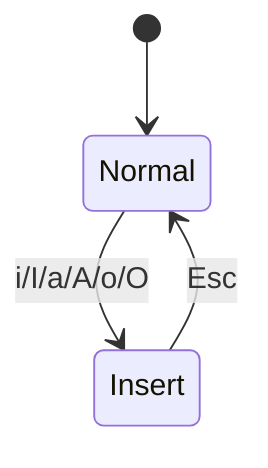

# ADR 002: Vim Modes State Machine

## Status

Proposed

## Context

Lazysql currently relies on tview primitives (notably `TextArea`) to handle text
input. Input capture is registered per component and resolves key events into
`commands.Command` with `app.Keymaps.Group(...).Resolve(event)`. There is no
global notion of Vim modes; all keys are processed as direct actions or text
input.

To match Vim/Neovim muscle memory, we need a mode state machine that separates
Normal (navigation/commands/leader) from Insert (text entry) while preserving
existing input handling and keeping the UI responsive.

## Decision Drivers

- Keep the mode logic isolated and testable (no tview dependency).
- Ensure leader keys are active only in Normal mode.
- Allow text entry in Insert mode without breaking tview `TextArea` behavior.
- Provide a consistent, always-visible mode indicator.
- Maintain predictable transitions for Vim users (i/a/o variants, Esc).

## Decision

Introduce a lightweight Vim mode state machine with two primary states:
Normal and Insert. The mode router sits in the input pipeline before leader
parsing and before component-specific keymaps, and decides whether to consume
keys or pass them through to focused components.

### States

- **Normal**: Navigation, leader sequences, command-line `:`.
- **Insert**: Text entry; only Escape is intercepted to return to Normal.

### Transitions

- **Normal → Insert**:
  - `i`: insert at cursor
  - `I`: insert at line start
  - `a`: append after cursor
  - `A`: append at line end
  - `o`: open new line below
  - `O`: open new line above
- **Insert → Normal**:
  - `Esc`

### Input Handling Rules

- **Normal mode**:
  - Handles navigation (`h/j/k/l`, `gg/G`, `w/b`) and leader sequences.
  - For components that are not text inputs, existing keymap resolution remains
    unchanged (Normal mode effectively passes keys to those handlers after
    leader/mode routing).
  - For text inputs, Normal mode consumes character keys unless explicitly
    mapped to commands or mode transitions.
- **Insert mode**:
  - All keys pass through to focused text input.
  - `Esc` is intercepted to exit Insert mode and clear any pending leader
    sequence.

### Mode Indicator

- Display strings: `-- NORMAL --` and `-- INSERT --`.
- Indicator is visible at all times (status bar or footer).
- Color cues: Normal (neutral), Insert (accent) to reduce ambiguity.

### Leader Interaction

- Leader system is only active in Normal mode.
- If the leader sequence is armed and mode switches to Insert, the leader state
  resets and the overlay is hidden.

### State Diagram



### Interfaces (Go)

```go
package vim

import (
	"context"
)

type Mode uint8

const (
	ModeNormal Mode = iota
	ModeInsert
)

type Action uint8

const (
	ActionPassThrough Action = iota
	ActionConsume
	ActionSwitchMode
)

type KeyEvent struct {
	Rune rune
	Key  KeyCode
}

type KeyCode uint8

const (
	KeyNone KeyCode = iota
	KeyEscape
)

type Result struct {
	Action Action
	Mode   Mode
	Key    KeyEvent
}

type ModeStateMachine interface {
	HandleKey(ctx context.Context, key KeyEvent) Result
	Mode() Mode
	SetMode(mode Mode)
}

type ModeIndicator interface {
	SetMode(mode Mode)
}
```

### Integration Notes

- The mode router should be invoked before the leader state machine and before
  component-specific keymaps.
- For `tview.TextArea`, Normal mode should not forward rune input unless it
  is a mapped Vim action; Insert mode forwards all rune input.
- Mode transitions that imply cursor movement (I/A/o/O) are handled by the
  focused text component adapter (e.g., TextArea wrapper).

## Consequences

- Adds a consistent, testable mode layer without rewriting existing components.
- Introduces a new adapter layer for text inputs to support Vim insert actions.
- Requires explicit UI affordance (mode indicator) to avoid user confusion.
