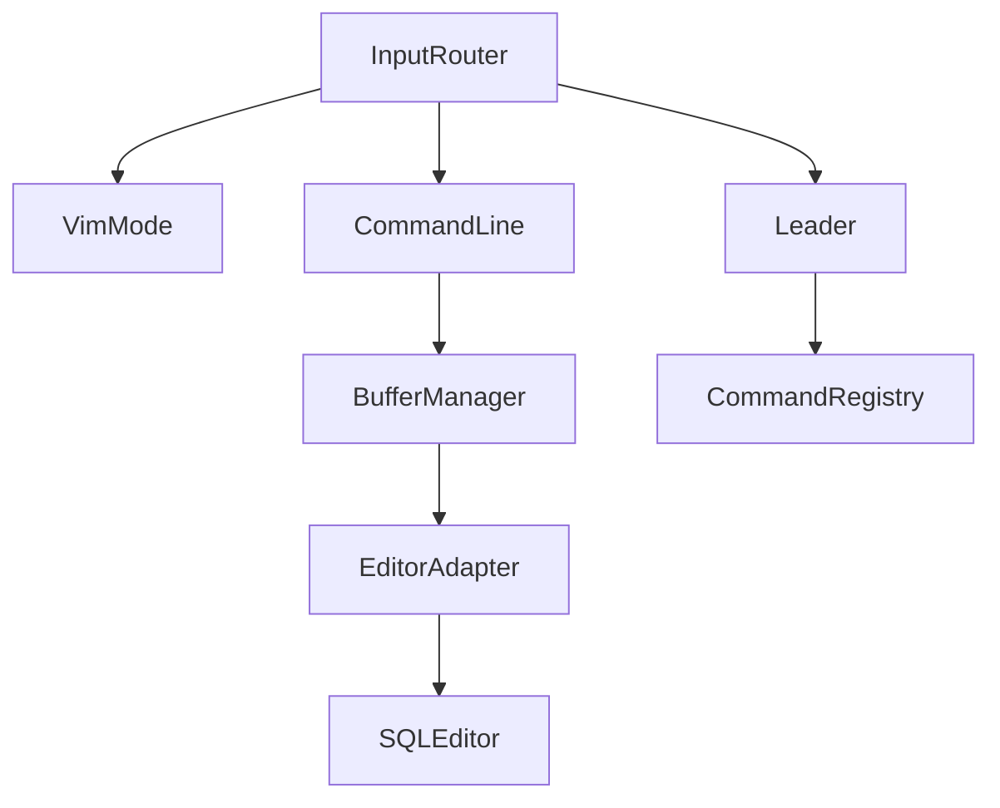

# ADR 005: Component Integration

## Status

Proposed

## Context

Leader keys, Vim modes, command-line mode, and buffers are defined in separate
ADRs. They must integrate cleanly with existing tview input capture, keymap
resolution, and core lazysql components (tree, results table, SQL editor).

## Decision Drivers

- Keep existing component behavior intact unless explicitly replaced.
- Provide a single, predictable input routing pipeline.
- Avoid circular dependencies by using small interfaces and DI.
- Ensure all core behaviors are testable without a running TUI.

## Decision

Introduce a thin input router that coordinates mode, leader, and command-line
behavior. The router is the only new global input capture and delegates to
existing component keymaps when appropriate.

### Component Dependencies



### Key Event Flow

1. `app.App.SetInputCapture` receives `tcell.EventKey`.
2. Router adapts event to a shared `vim.KeyEvent` type and checks current mode.
3. **Insert mode**:
   - `Esc` switches to Normal (consume).
   - All other keys pass through to focused primitive.
4. **Normal mode**:
   - `:` opens command-line input (consume).
   - `\` starts leader sequence (consume).
   - Leader state machine consumes keys while armed.
   - Otherwise, pass event through to existing component keymaps.
5. Command results are dispatched to existing handlers (or new buffer/leader
   handlers) via the existing command execution flow.

### Shared State

```go
type Runtime struct {
	Mode        vim.ModeStateMachine
	Leader      leader.StateMachine
	Buffers     buffer.Manager
	CommandLine cmdline.Input
}
```

`Runtime` is constructed in `app.App` and passed to components that need it
via dependency injection.

### Integration Points (Existing Lazysql)

| File | Integration |
|------|-------------|
| `app/app.go` | Replace input capture with router (preserve Ctrl+C handling). |
| `app/keymap.go` | Keep keymap resolution; add leader command registry. |
| `components/sql_editor.go` | Adapt to Vim modes for insert/normal behavior. |
| `components/results_table.go` | Respect Normal mode navigation bindings. |
| `components/tree.go` | Continue using keymaps; leader routes commands. |
| `components/tabbed_menu.go` | Use buffer manager to manage editor tabs. |

### Initialization Order

1. Build `BufferManager`.
2. Build `VimMode` state machine.
3. Build `Leader` state machine + registry.
4. Build `CommandLine` input (depends on buffer manager).
5. Build `InputRouter` and set `App.SetInputCapture`.

## Consequences

- Centralizes input flow and reduces scattered mode logic.
- Requires minimal adapter code to bridge tview events to Vim systems.
- Ensures leader/command-line features do not conflict with existing keymaps.
